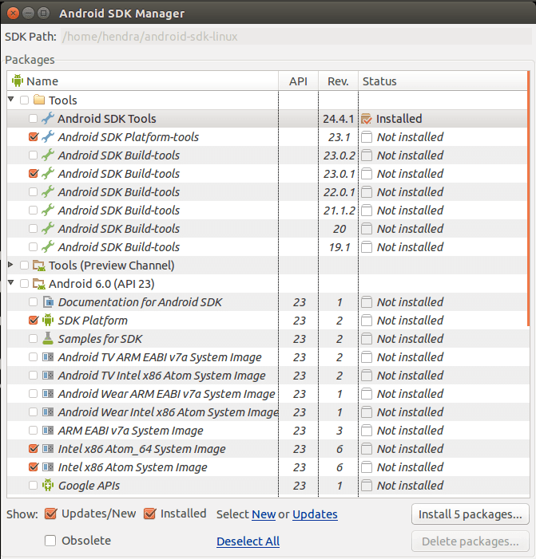
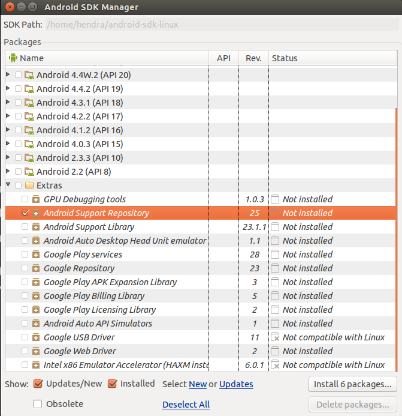
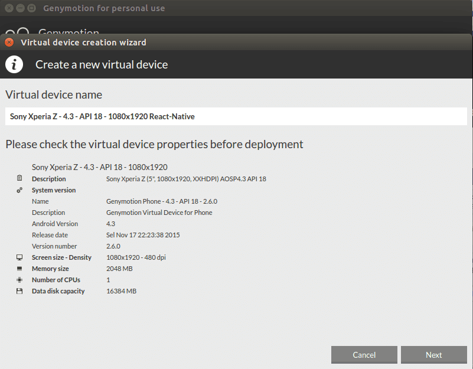
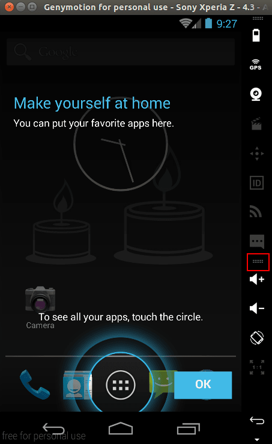

# react-native-ubuntu
Cara Setting development environtment react-native di Ubuntu, beserta contoh aplikasi.
Pada contoh ini saya menggunakan Ubuntu 14.04 LTS dan sudah terinstall git.
Semua download zip ditaruh di folder

```bash
$ /home/(user)
```

Jika ada pertanyaan, silahkan bertanya di group Facebook [ReactJS Indonesia](https://www.facebook.com/groups/442974152553174/).

[Contoh Aplikasi](examples/README.md)

## Setting development environtment react-native di ubuntu

Checklist yang harus dilakukan:

- [x] Install node.js v4.0 keatas atau menggunakan NVM
- [x] Install Watchman (beserta setting compability watchman di ubuntu)
- [x] Install Flow
- [x] Install & Setting Environtment Variabel Android JDK dan SDK
- [x] Install SDK yang akan digunakan untuk react-native android
- [x] Install VirtualBox dan GenyMotion
- [x] Download dan Run virtual Device android
- [ ] install react-native-cli
- [ ] Init project
- [ ] Contoh menggunakan library 3rd party dari npm
- [ ] Deploy APK

## Install node.js v4.0 keatas atau menggunakan NVM

Pastikan node -v anda v4.0 keatas
untuk mengecek versi node anda

```bash
$ node -v
```

jika belum v4.0 keatas install [NVM](https://github.com/creationix/nvm#installation)
```bash
$ curl -o- https://raw.githubusercontent.com/creationix/nvm/v0.29.0/install.sh | bash
```

Close dan buka terminal anda,
Install node 4.2.3 menggunakan NVM
```bash
$ nvm install 4.2.3
$ node -v
$ #v4.2.3
```
## Install Watchman

Install [Watchman](https://facebook.github.io/watchman/docs/install.html). Jika './autogen.sh' tidak jalan, anda mungkin perlu menginstall automake 'sudo apt-get install automake' dan [python-dev](http://packages.ubuntu.com/search?keywords=python-dev).

```bash
$ git clone https://github.com/facebook/watchman.git
$ cd watchman
$ git checkout v4.1.0  # the latest stable release
$ ./autogen.sh
$ ./configure
$ make
$ sudo make install
```

### Setting Compability watchman pada ubuntu
Pada kondisi default, watchaman pada ubuntu hanya bisa jalan 1 user. Sehingga perintah 'react-native start' pada ubuntu hanya bisa jalan 1 kali (untuk start lagi harus merestart komputer).

Untuk memperbaikinya anda harus menambah value [inotify watchers](https://github.com/guard/listen/wiki/Increasing-the-amount-of-inotify-watchers) pada ubuntu.

## Install Flow
Flow saat ini support untuk arsitektur 64 bit, untuk ubuntu versi lain silahkan kunjungi [website flow](http://flowtype.org/docs/getting-started.html#_).

```bash
$ wget https://facebook.github.io/flow/downloads/flow-linux64-latest.zip
$ unzip flow-linux64-latest.zip
$ cd flow
$ echo -e "\nPATH=\"\$PATH:$(pwd)/\"" >> ~/.bashrc && source ~/.bashrc

$ flow version
$ #Flow, a static type checker for JavaScript, version 0.19.1
```

## Install & Setting Environtment Variabel Android JDK dan SDK

Download [JDK](http://www.oracle.com/technetwork/java/javase/downloads/jdk8-downloads-2133151.html)
copy hasil download ke /home/(user) lalu jalankan perintah
```bash
$ tar -xvzf jdk-8u65-linux-x64.tar.gz
$ export JAVA_HOME=/home/(user)/jdk1.8.0_65
$ export PATH=$PATH:/home/(user)/jdk1.8.0_65/bin

$ javac -version
$ #javac 1.8.0_65
```

Download [standalone android SDK](https://developer.android.com/sdk/installing/index.html?pkg=tools)
copy hasil download ke /home/(user) lalu jalankan perintah
```bash
$ tar -xvzf android-sdk_r24.4.1-linux.tgz
$ export ANDROID_HOME=/home/(user)/android-sdk-linux
$ nano ~/.bashrc
```
Akan terbuka nano text editor, lalu masukan kode berikut

```bash
#AndroidDev PATH
export PATH=${PATH}:~/android-sdk-linux/tools
export PATH=${PATH}:~/android-sdk-linux/platform-tools
```
(user) harus diganti dengan nama user yang anda gunakan!
setelah itu save dengan menekan ctr+x enter, lalu Y dan enter.

Tutup dan buka lagi terminal.
lalu ketik
```bash
$ android
```
Setelah dialog Android SDK Manager muncul tinggal menginstall SDK yang diperlukan

## Install SDK yang akan digunakan untuk react-native android
Install SDK seperti gambar dibawah ini




## Install VirtualBox dan GenyMotion

Silahkan download [GenyMotion & Virtualbox](https://www.genymotion.com/#!/developers/user-guide), ikuti langkah-langkah pada websitenya tinggal register dan download versi freenya.

## Download dan Run virtual Device android

Pada contoh ini saya menggunakan virtual device Sony Xperia Z


Setelah selesai download, silahkan run virtual device.
Tampilan jika Genymotion berjalan dengan baik


Tarik icon yang saya tandai dalam kotak merah keatas, agar mudah mengakses menu ReloadJS (pada saat develop react native nanti).
